# 
<h3>Beyond Primary Sources: Digital Archives in the DH Classroom</h3>

Mackenzie Brooks, Assistant Professor and Digital Humanities Librarian

Digital Archives in the Commonwealth Summit

October 13, 2017

# DH @ WLU 
<a href="http://digitalhumanities.wlu.edu/">http://digitalhumanities.wlu.edu/</a>

# 

How can digital archives serve library faculty in teaching info/digital literacies and methodologies?

# DH curriculum
* DH 101 - Intro to Digital Humanities 
* DH 102 - Data in the Humanities 
* DH 110 - Programming for Non-programmers
* DH 190 - Scholarly Text Encoding 
* DH 180 - Communication through the Web
* DH ??? 	

# Learning Outcomes
1. Ability to integrate digitally driven research goals, methods, and media with discipline-specific inquiry.
2. Ability to understand, analyze, and use data.
3. Develop critical savvy for assessing sources and data.
4. Ability to assess information and information technologies critically.
5. Ability to work collaboratively.

Burdick, Anne, ed. *Digital_humanities*. Cambridge, Mass: MIT Press, 2012. https://mitpress.mit.edu/sites/default/files/titles/content/9780262018470_Open_Access_Edition.pdf

# Bryn Mawr Digital Competencies
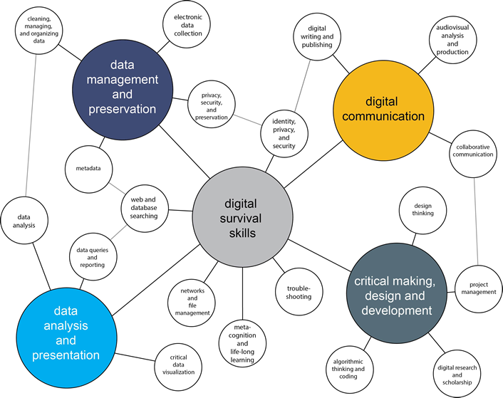

[https://www.brynmawr.edu/digitalcompetencies](https://www.brynmawr.edu/digitalcompetencies)

# Collections as Data
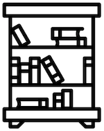

[https://collectionsasdata.github.io/](https://collectionsasdata.github.io/)

# DH 101 v.1
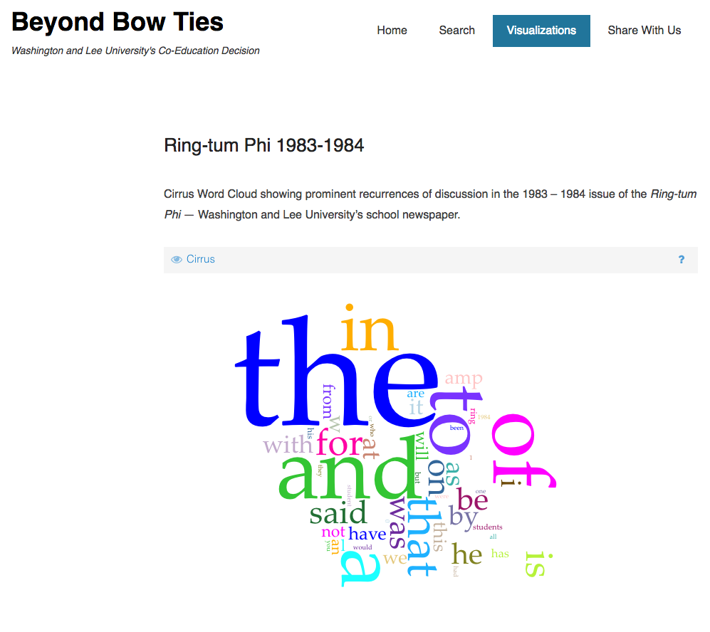

# DH 101 v.2
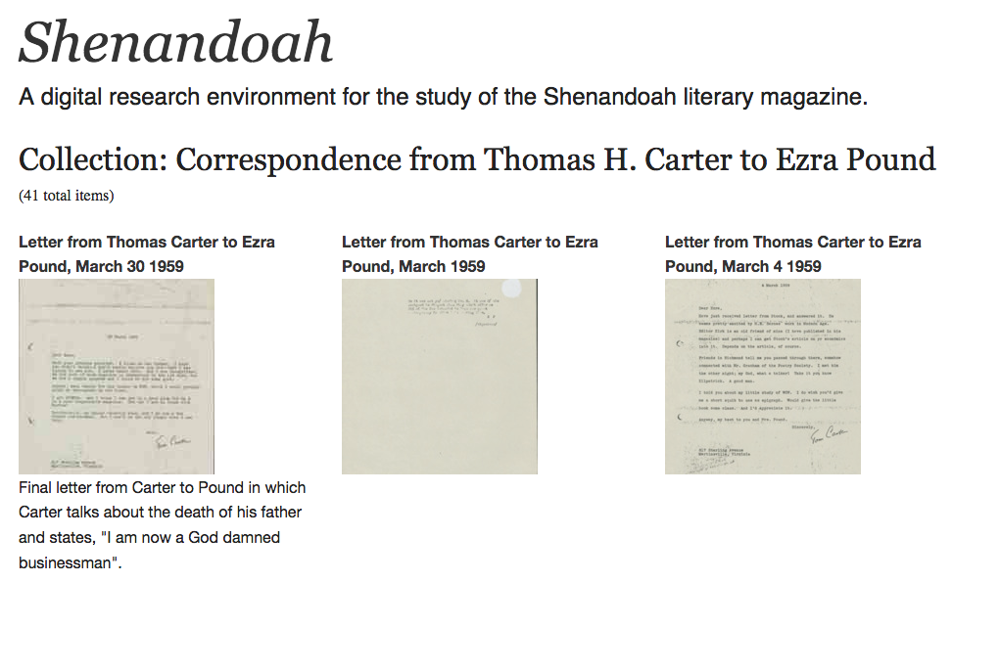

# ENGL 363: American Poetry
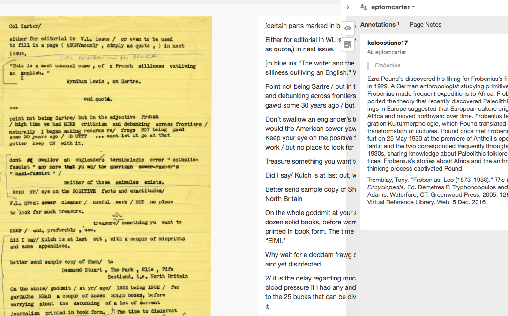

# DH 190: Scholarly Text Encoding
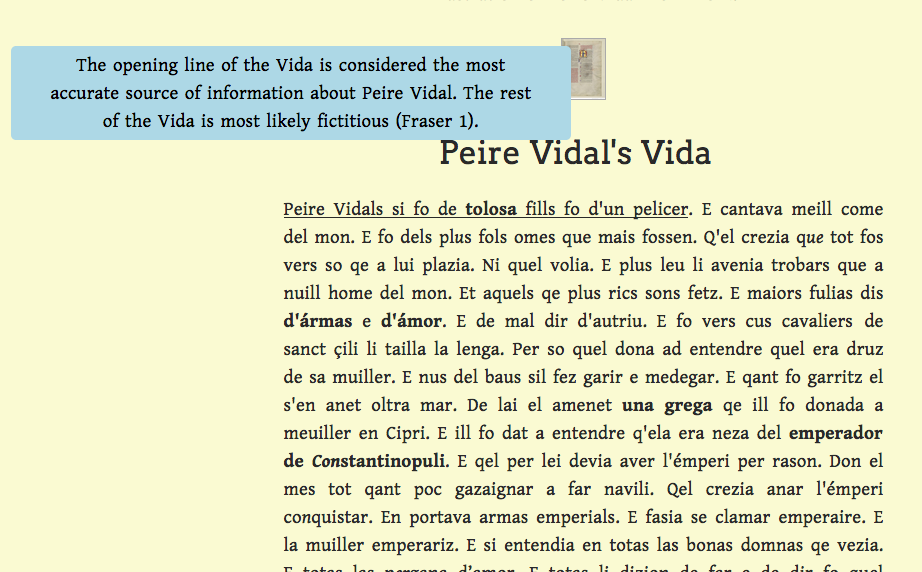

# DH 102 Data in the Humanities 
* Unit 1: Text
* Unit 2: Network
* Unit 3: Space

# DH 102 - Ring-tum Phi
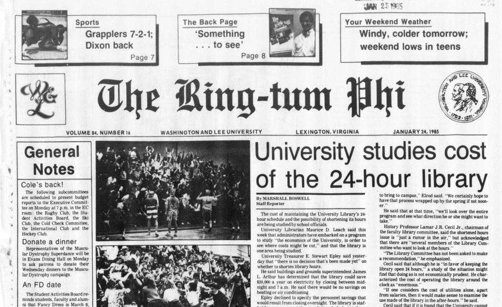

# DH 102 - Ring-tum Phi

# DH 102 - Ring-tum Phi
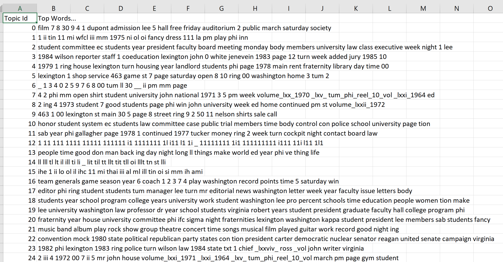

# DH 102 - Ring-tum Phi
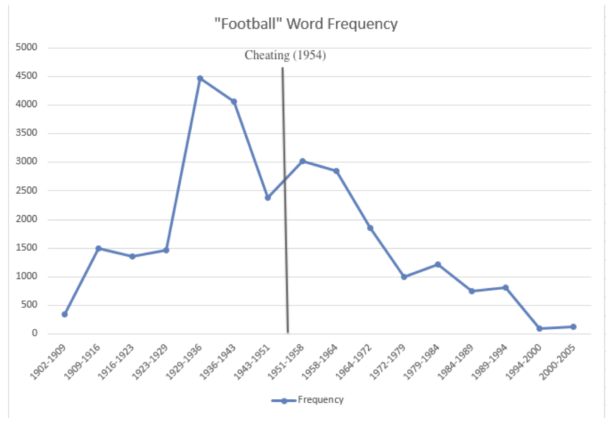

# DH 102 - unit 1
* text analysis
* topic modeling
* file naming conventions
* zip files and cloud storage
* command line
* regular expressions
* visualization

# DH 102 - cemetery database
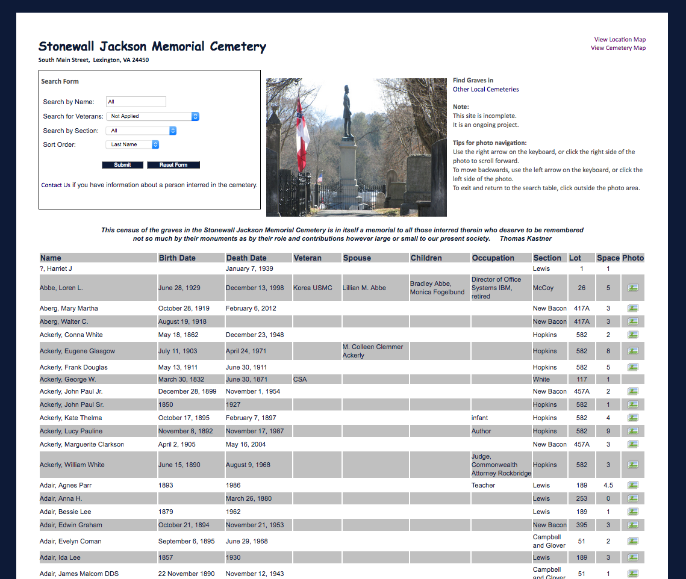 

# DH 102 - cemetery database
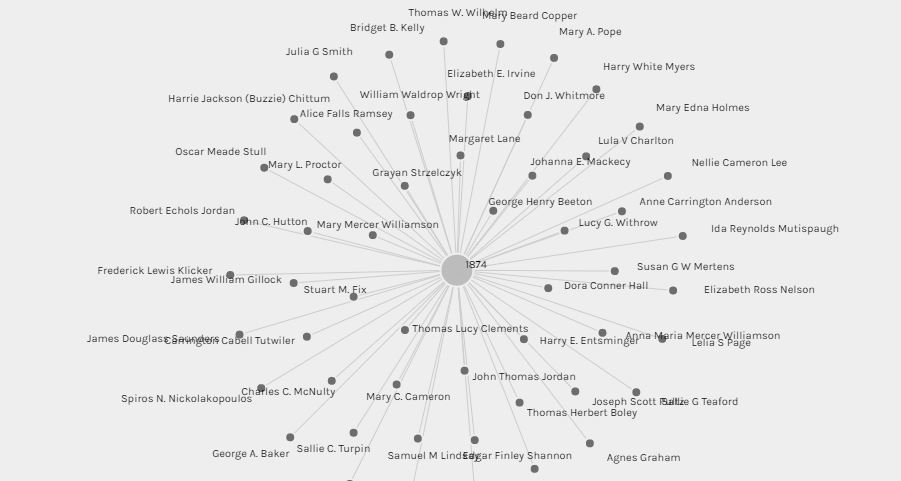 

Will Tucker

# DH 102 - cemetery database
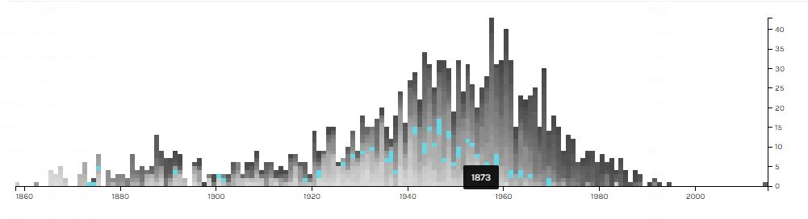 

Will Tucker

# DH 102 - unit 2

* Shenandoah periodical index
* Thomas H. Carter personal library metadata 

# DH 102 - unit 2
* data structures
* Open Refine
* linked data
* network visualizations
* network analysis 
* documentation

# conclusions
* interfaces and APIs are great, but data in bulk is best for beginners
* even messy data is useful
* 

