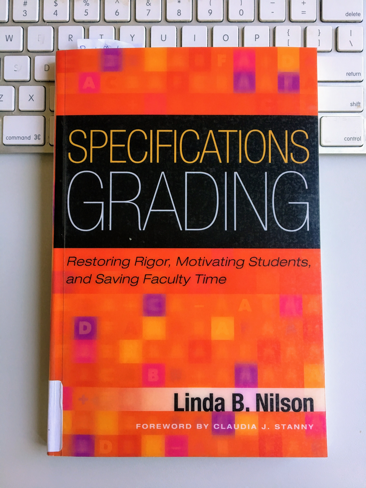

# Assessing Failure: Specifications Grading for Digital Pedagogy

Mackenzie Brooks, Assistant Professor and Digital Humanities Librarian

DLF Forum,

October 24, 2017

# Context 
* New course: Data in the Humanities
* Teaching solo
* 12 weeks, 3 credits

# Audience 
* All majors, all years
* Grade conscious, rubric demanding
* Uncomfortable with ambiguity
* Self-labeled "bad at technology"

# Desires
* Inclusive pedagogy 
* Build confidence with tech
* Domains
* Metacognition/how to learn

# Productive failure 
* Croxall, Brian, and Quinn Warnick. “Failure.” Digital Pedagogy in the Humanities: Concepts, Models, and Experiments, Modern Language Association, 2016, https://digitalpedagogy.mla.hcommons.org/keywords/failure/.

# Specifications Grading
 

# How it works
* 

# Implementation

# What Worked

# What Didn't Work 

The DH community values the concept of “productive failure." But how do we model and reward this concept for students in the confines of a course? This presentation will describe an alternative grading system known as “Specifications Grading” and its use in two iterations of an undergraduate DH course.

The DH community values the concept of “productive failure." Breaking tools or playing around with methodologies deepens our skills in ways that strictly following a tutorial cannot. As researchers, this behavior is encouraged as part of the research process and documented on blogs and social media. But how do we model this concept for students in a meaningful way? How do we reward their own productive failure within the confines of a course? Not only are undergraduates newcomers to both traditional and digital research methodologies, they arrive with varying levels of technology experience. Some have too much confidence in their abilities while others do not have enough. On some campuses, students are extremely grade conscious and demand detailed rubrics for even the most experimental assignments. Designing engaging and fair assignments in this context is a challenge.

This presentation will describe an alternative grading system known as “Specifications Grading” and its use in an undergraduate DH course. From the student perspective, this system aims to reduce the stress and mystery of grades while also raising academic standards. From the instructor perspective, Specs Grading is intended to reduce grading time and force assignments to actually reflect learning objectives. In a DH course, Specs Grading works by requiring and assessing student work on individual phases of methodology, rather than the final product. The presentation will provide an overview of the grading system, its use in a 2016 course, and revisions to the system for a second offering of the course in fall 2017.

