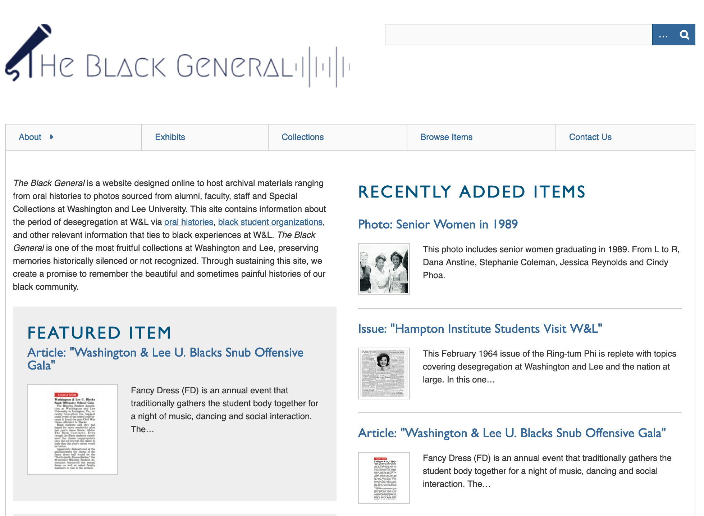
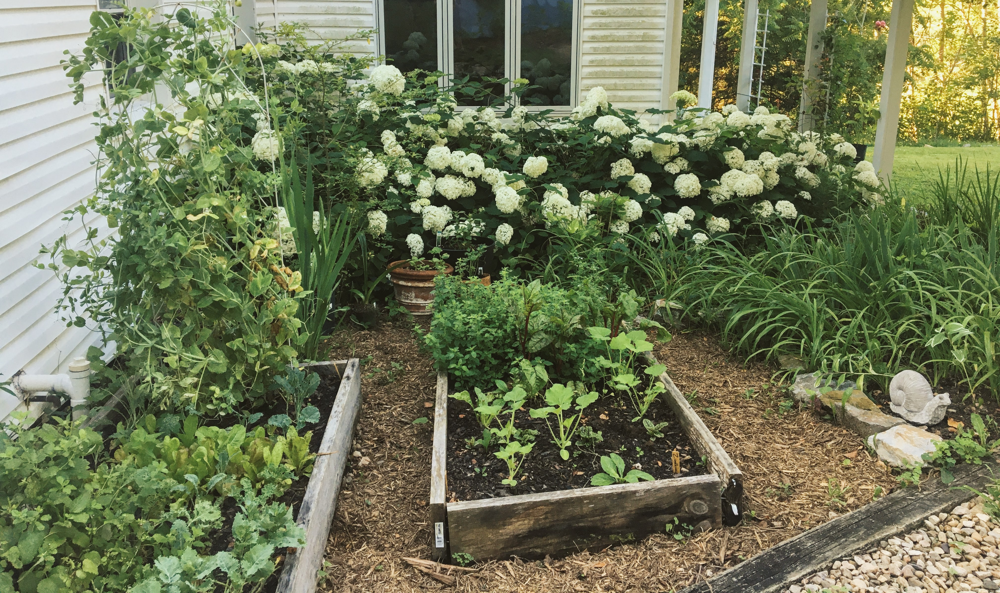

#
> what types of maintenance and repair take place on college campuses?

> how do we care for projects and objects of study?

> how do I help cultivate a regard for maintenance in my students?

# 
1. Library as Lab 
2. [Digital Culture & Information](https://my.wlu.edu/digital-culture-and-information) /= DH 
3. but also: growing food and making clothes

# part 1 library as lab
> work with students, faculty, and staff to incorporate digital methods into their teaching and research 

# 
 

[http://florenceasitwas.wlu.edu](http://florenceasitwas.wlu.edu)

# 

[https://blackgeneral.omeka.wlu.edu/](https://blackgeneral.omeka.wlu.edu/)

# part 2 digital culture & information

# DH /= DCI 

* Designed to teach students concepts and methods that will enhance their academic success within any major. 
* Gain significant experience with technological platforms, complex information resources, and visual design. 
* Nurtures critical reflection on the underlying structure of information and not merely technical proficiency. 

# DCI courses 
* Data in the Humanities
* Programming for Non-Programmers
* Black Mirrors & Digital Culture
* New Dark Age 

# part 3

# 

# 

# 

[Read/Write Library](https://readwritelibrary.org/) // Chicago, IL

# 

